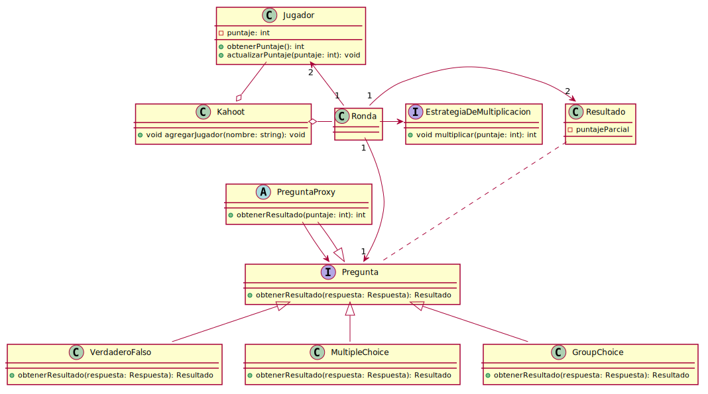

**Diagrama de clases principal**
<div hidden>
```
@startuml class-diagram-main.svg
'Clases
class Kahoot {
  +void agregarJugador(nombre: string): void
}

class Jugador {
  -puntaje: int
  +obtenerPuntaje(): int
  +actualizarPuntaje(puntaje: int): void
}
class Ronda {
  
}

class Resultado {
  -puntajeParcial
}

class VerdaderoFalso {
  +obtenerResultado(respuesta: Respuesta): Resultado
}

class MultipleChoice {
  +obtenerResultado(respuesta: Respuesta): Resultado
}

class GroupChoice {
  +obtenerResultado(respuesta: Respuesta): Resultado
}

abstract class PreguntaProxy {
  +obtenerResultado(puntaje: int): int
}


'Interfaces
interface EstrategiaDeMultiplicacion {
  +void multiplicar(puntaje: int): int
} 

interface Pregunta {
  +obtenerResultado(respuesta: Respuesta): Resultado
}

'Relaciones/ disposición
Jugador -up-o Kahoot
Ronda -right-o Kahoot
Ronda -right-> EstrategiaDeMultiplicacion
Ronda "1" -up-> "2" Jugador
Ronda "1" -down-> "1" Pregunta
Ronda "1" -> "2" Resultado
Pregunta -up.. Resultado
Pregunta <|-down- VerdaderoFalso
Pregunta <|-down- MultipleChoice
Pregunta <|-down- GroupChoice
Pregunta <|-down- PreguntaProxy
Pregunta <-down- PreguntaProxy
@enduml
```
</div>

